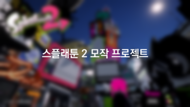

# Splatoon 2
(본 레포지토리는 프로젝트용이 아닌 포트폴리오 참고자료용으로 소스코드만 포함되어 있습니다.)  
## 개요
스플래툰 2 모작 프로젝트입니다.  
- 플랫폼: PC(Windows)
- 개발인원: 1명
- 개발도구: Unity3D, Visual Studio, goormIDE, phpMyAdmin, AWS S3

## 플레이 영상

## 소스코드 목록
![[splatoon2_map.png]]

## 리소스 출처
(본 레포지토리 미포함, 플레이 영상에서 확인 가능)  
#### 2D·3D 리소스
- [The Spriters Resource](https://www.spriters-resource.com/nintendo_switch/splatoon2/)
- [The Models Resource](https://www.models-resource.com/nintendo_switch/splatoon2/)
- Super Sea Snails Icon Image - [Inkipedia](https://splatoonwiki.org/wiki/Super_Sea_Snail#Splatoon_2)  

※일부 2D 리소스 직접 제작  
#### 플레이어 애니메이션
- [Mixamo](https://www.mixamo.com/#/)
#### 폰트
- [Denk One](https://fonts.google.com/specimen/Denk+One)
- [Ranchers](https://fonts.google.com/specimen/Ranchers)
- [Teko](https://fonts.google.com/specimen/Teko)
- [Splatfont 2](https://blogfonts.com/splatfont-2.font) 
#### 셰이더
- 잉크 셰이더 - [Splatoon's Ink System | Mix&Jam](https://github.com/mixandjam/Splatoon-Ink/tree/main)
#### 오픈소스
- 페인팅 - [Unity仿Splatoon喷漆效果](https://github.com/xieliujian/UnityDemo_Splatoon2/tree/master)  
※변형하여 적용, 본 레포지토리에는 제외되어 있음